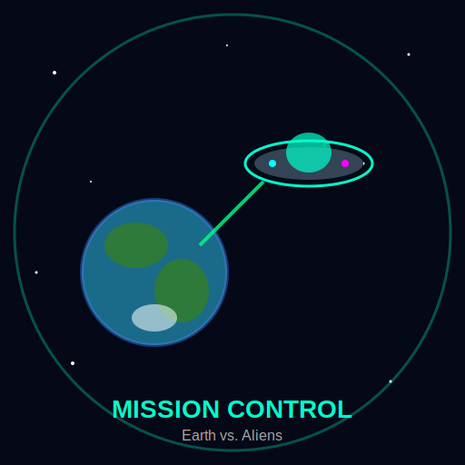

# Mission Control: Earth vs. Aliens



A 3D browser-based space quiz game where you defend Earth from an alien invasion by answering astronomy and space questions correctly. Built with Node.js, Express, MySQL, and Three.js.

## Description

Mission Control: Earth vs. Aliens puts you in the role of Earth's last line of defense. An alien spaceship approaches Earth, and every wrong answer brings it closer — firing missiles that damage Earth's shield. Answer correctly to push the alien ship back and protect the planet. The game features a fully animated 3D Earth, an alien ship with weapon effects, a damage-based shield system, difficulty levels, a timer, sound effects, and an online leaderboard.

## Technologies

- **Frontend:** HTML5, CSS3, JavaScript (ES6), Three.js (3D graphics), Web Audio API
- **Backend:** Node.js, Express.js
- **Database:** MySQL (via `mysql2`)
- **Authentication:** JWT (jsonwebtoken), bcryptjs for password hashing
- **Hosting:** Railway (app + MySQL database)

## Requirements

- [Node.js](https://nodejs.org/) (v18 or higher recommended)
- [npm](https://www.npmjs.com/) (comes with Node.js)
- [MySQL](https://www.mysql.com/) (local installation or a hosted instance, e.g. via XAMPP or Railway)
- [Git](https://git-scm.com/) (for cloning and version control)

## Installation

1. Clone the repository:
   ```
   git clone https://github.com/mdhasnoe-ui/Mission-Control-Earth-vs-Aliens-2.git
   ```

2. Navigate into the project folder:
   ```
   cd Mission-Control-Earth-vs-Aliens-2
   ```

3. Install dependencies:
   ```
   npm install
   ```

4. Create a `.env` file based on `.env.example` (see [Database Setup](#database-setup) below).

5. Start the server:
   ```
   npm run dev
   ```

6. Open your browser and go to:
   ```
   http://localhost:3000
   ```

## Database Setup

1. Make sure MySQL is running (locally via XAMPP, or a hosted MySQL instance such as Railway).

2. Run the schema file to create the database and tables:
   ```
   mysql -u root -p < sql/schema.sql
   ```

3. (Optional) Load example/demo data into the leaderboard:
   ```
   mysql -u root -p mission_control < sql/seed.sql
   ```

4. Create a `.env` file in the project root with the following variables:
   ```
   PORT=3000
   DB_HOST=localhost
   DB_USER=root
   DB_PASSWORD=
   DB_NAME=mission_control
   DB_PORT=3306
   JWT_SECRET=your_secret_key_here
   ```

## Usage

- Open the game in your browser.
- Register an account or play as a guest.
- Choose a difficulty level: Easy, Medium, or Hard.
- Answer space-themed questions before the timer runs out.
- Correct answers push the alien ship back; wrong answers let it fire a missile at Earth's shield.
- Survive all questions to win, or watch Earth's shield collapse if your health reaches 0%.
- Logged-in players' scores are saved and shown on the leaderboard.

## Project Structure

```
├── app.js                  # Express app setup and routes
├── server.js               # Server entry point
├── config/
│   ├── db.js                # MySQL connection pool
│   └── database.sql         # Legacy combined schema file
├── sql/
│   ├── schema.sql            # Database schema (tables)
│   └── seed.sql               # Example seed data
├── middlewares/
│   ├── authMiddleware.js     # JWT authentication middleware
│   └── validationMiddleware.js # Request validation middleware
├── routes/
│   ├── authRoutes.js         # Login & register routes
│   └── scoreRoutes.js        # Leaderboard & score routes
└── public/
    ├── css/                  # Stylesheets
    ├── js/                   # Game logic and 3D rendering
    ├── img/                  # Images and assets
    └── index.html            # Main game page
```

## License

This project was created as a school assignment (beroepsproduct).
